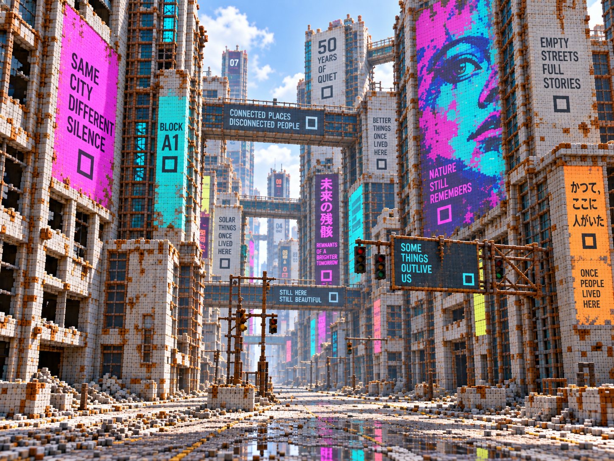
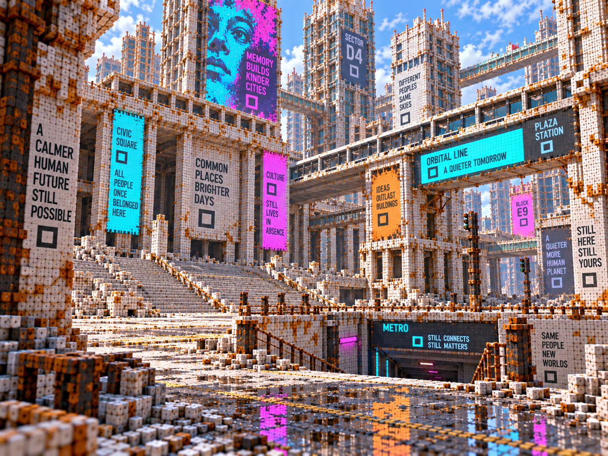
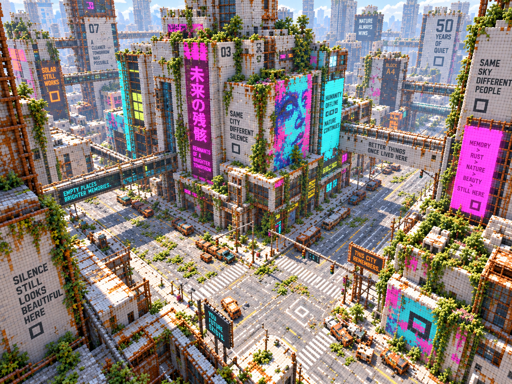

# Lenguaje visual y reglas del mundo
## Ciudad voxel futurista — guía de dirección artística y generación procedural

> Documento de trabajo. Define la identidad visual, las reglas espaciales y las convenciones técnicas del mundo para mantener coherencia entre arte, herramientas, generación procedural y runtime.

---

## 1. Visión general

La ciudad debe sentirse como una metrópolis futurista abandonada, construida bajo una lógica modular y geométrica muy estricta.

No busca repetir el cyberpunk clásico de calles oscuras, lluvia constante, neón sobre fondos negros y arquitectura caótica. La identidad del mundo se apoya en el contraste entre:

- arquitectura blanca, clara y monumental;
- geometría ortogonal basada en cuadrados, cubos, prismas y bloques;
- acentos de color intensos;
- señales, carteles y murales de gran escala;
- abandono, desgaste y silencio;
- una estética voxel visible y asumida como parte esencial del mundo;
- iluminación diurna limpia, especialmente luz de mediodía.

El mundo debe poder leerse como una ciudad construida por una civilización que pensaba en módulos, repetición, eficiencia y expansión vertical.

**La estética voxel no se oculta: los voxels son parte del lenguaje del mundo y deben sentirse intencionales.**

---

# 2. Pilares visuales

## 2.1. Arquitectura ortogonal

Regla principal: **evitar curvas siempre que sea posible.**

La arquitectura se construye mediante:

- cubos;
- prismas rectangulares;
- bloques apilados;
- plataformas;
- retranqueos;
- huecos rectangulares;
- columnas cuadradas;
- pasarelas;
- puentes;
- marcos estructurales;
- módulos repetitivos.

Las siluetas deben construirse mediante adición, sustracción y desplazamiento de bloques.

Una estructura compleja no necesita geometría compleja. Su riqueza visual debe surgir de la superposición de volúmenes simples.

Ejemplo conceptual:

```text
Base
→ Extrusión vertical
→ Retranqueo
→ Bloque lateral
→ Vacío
→ Segundo volumen
→ Pasarela
→ Volumen técnico
→ Corona
```

## 2.2. Paleta

### Base

Predominan materiales claros:

- blanco;
- marfil;
- gris muy claro;
- hormigón pálido;
- metal claro;
- superficies ligeramente desaturadas.

### Acentos

Los colores intensos funcionan como contraste y sistema de orientación:

- cian;
- turquesa;
- magenta;
- rosa intenso;
- naranja;
- amarillo cálido;
- verde lima;
- violeta.

Los colores vivos deben aparecer principalmente en señalización, paneles, publicidad, murales, identificadores de bloques, infraestructura e iluminación técnica.

La ciudad debe seguir pareciendo clara incluso cuando utiliza colores saturados.

## 2.3. Luz

La iluminación de referencia es:

- mediodía;
- cielo brillante;
- alta visibilidad;
- sombras claras;
- contraste moderado;
- buena lectura de volúmenes.

La ciudad no depende de la oscuridad para parecer cyberpunk. El objetivo es crear una variante de cyberpunk visible a plena luz del día.

---

# 3. Escala voxel

## 3.1. Unidad base del diseño

Unidad física objetivo para el perfil urbano y la generación procedural:

```text
Voxel base = 0.03125 m
           = 3.125 cm
           = 1/32 de metro
```

Ventajas:

- 1 m = 32 voxels;
- 2 m = 64 voxels;
- 4 m = 128 voxels;
- progresión binaria limpia;
- grids anidados cuando comparten origen y orientación;
- simplificación de LOD;
- snapping y generación procedural predecibles.

El laboratorio admite regenerar los modelos de prueba para adoptar esta unidad antes de trasladar las herramientas al proyecto del juego. Los assets existentes conservan la escala registrada en sus metadatos hasta su regeneración explícita; cambiar un perfil no debe reinterpretar sus coordenadas ni redimensionarlos silenciosamente. La configuración de perfiles y la regeneración se realizan durante la preparación de la manzana piloto.

## 3.2. Jerarquía de resoluciones

Todos los tamaños voxel deben ser múltiplos exactos de la unidad base.

```text
LOD0   0.03125 m
LOD1   0.06250 m
LOD2   0.12500 m
LOD3   0.25000 m
LOD4   0.50000 m
LOD5   1.00000 m
```

No deben existir escalas arbitrarias.

Un asset grande puede comenzar directamente en una resolución equivalente a LOD1, LOD2 o superior, siempre que respete esta progresión.

La tabla representa escalas físicas, no seis niveles obligatorios para cada asset. En una familia, `LOD0` identifica su representación de mayor detalle, aunque utilice un múltiplo inicial más grueso de la unidad base.

## 3.3. Una retícula común para todo el mundo

La ciudad comparte una retícula global:

```text
World Grid Base = 0.03125 m
```

Siempre que sea viable:

```text
X = n × 0.03125
Y = n × 0.03125
Z = n × 0.03125
```

Esto permite que edificios, puentes, props, paneles, tuberías, módulos procedurales y fachadas pertenezcan al mismo sistema espacial.

El resultado debe transmitir que el mundo entero fue construido utilizando una tecnología modular común.

---

# 4. Voxel geométrico vs. voxel visual

No es necesario conservar físicamente cada voxel en la geometría final.

## Voxel geométrico

Se conserva cuando afecta:

- la silueta;
- la forma del objeto;
- una esquina;
- una rotura;
- una escalera;
- una protrusión;
- un volumen reconocible.

## Voxel visual

Puede reconstruirse mediante shader cuando la geometría es plana.

Una pared formada originalmente por miles de voxels puede convertirse en una superficie muy simple. El shader vuelve a introducir:

- juntas;
- microbisel;
- roughness;
- AO;
- pequeñas variaciones por celda.

Objetivo: **estética voxel sin pagar el coste geométrico completo del voxel.**

---

# 5. Grid visible en materiales

El grid voxel debe ser perceptible, pero no parecer una línea negra dibujada sobre las superficies.

Evitar:

```text
cuadrícula oscura uniforme sobre el albedo
```

Preferir:

- microbisel;
- junta ligeramente hundida;
- variación sutil de normales;
- acumulación de AO;
- diferencias leves de roughness;
- variaciones muy pequeñas de color.

La cuadrícula debería descubrirse al acercarse. Desde lejos debe sentirse como textura. De cerca debe quedar claro que la superficie está construida por voxels.

## 5.1. Parámetros sugeridos para shader

```text
_VoxelSize
_VoxelGridOrigin
_GridStrength
_GridDepth
_GridRoughness
_GridNormalStrength
_GridFadeDistance
```

`_VoxelSize` representa la unidad física de detalle del perfil, no el tamaño de la celda del LOD activo. Mantener la escala del patrón al cambiar de LOD y filtrar o atenuar las divisiones finas según su tamaño en pantalla. Los parámetros son orientativos para un prototipo, no una API implementada.

## 5.2. Anclaje de la rejilla

La arquitectura estática alineada puede utilizar una rejilla mundial con origen común para mantener continuidad entre módulos. La escala, el origen y la orientación deben ser compatibles; compartir únicamente el tamaño de voxel no garantiza continuidad.

Los vehículos y otros objetos dinámicos conservan una rejilla anclada al modelo que los acompaña al trasladarse o rotar. Dentro de cada familia, el origen del patrón es independiente de los chunks y de los LODs. Verificar el tratamiento de las escalas antes de afirmar que el tamaño físico permanece constante.

## 5.3. Proyección triplanar

Para arquitectura ortogonal, el grid puede proyectarse según la normal dominante.

```text
Cara orientada a X → usar YZ
Cara orientada a Y → usar XZ
Cara orientada a Z → usar XY
```

Esto evita depender exclusivamente de UVs para representar la retícula.

---

# 6. Anti-aliasing del grid

Una retícula repetitiva muy pequeña puede provocar:

- moiré;
- shimmering;
- parpadeo;
- ruido visual a distancia.

La máscara del grid debe suavizarse utilizando derivatives de pantalla:

```text
fwidth
ddx
ddy
```

Nunca depender únicamente de comparaciones binarias duras.

El grid debe desvanecerse o simplificarse progresivamente cuando su tamaño aparente se aproxima a un píxel.

---

# 7. LOD y continuidad visual

Al utilizar escalas binarias:

```text
3.125 cm
6.25 cm
12.5 cm
25 cm
50 cm
1 m
```

cada nivel geométrico superior puede coincidir con divisiones del anterior si comparte su alineación. La reducción utiliza la resolución y el origen reales del volumen, no una rejilla aproximada dibujada sobre la vista.

La rejilla superficial del shader mantiene su escala física entre niveles. Sus frecuencias finas se atenúan a distancia; no se sustituyen automáticamente por juntas más grandes al cambiar de LOD.

**El LOD reduce la complejidad geométrica; el filtrado controla la legibilidad del detalle superficial.**

---

# 8. Jerarquía de detalle

Referencia orientativa:

```text
3.125 cm   microdetalle / props cercanos
6.25 cm    props normales / detalles finos
12.5 cm    detalles arquitectónicos
25 cm      arquitectura estructural
50 cm      masa de edificios
1 m        skyline / generación urbana gruesa
```

No todos los objetos necesitan todos los niveles.

---

# 9. Importancia de features

Los detalles pueden clasificarse según su importancia:

```text
Micro
Detail
Structural
Silhouette
```

Esta clasificación es una guía artística, no un nuevo atributo por voxel ni una prioridad automática del reductor. La evaluación y corrección se realizan con el preview del siguiente LOD y la edición explícita de cada nivel. No se requiere una herramienta adicional de etiquetado de importancia para esta etapa; la reducción no garantiza conservar detalles subvoxel.

### Micro
Puede desaparecer pronto: ranuras pequeñas, tornillos, microdesgaste.

### Detail
Debe sobrevivir varios LOD: marcos, cajas, paneles, pequeñas tuberías.

### Structural
Define la estructura: columnas, soportes, entradas, vigas, grandes paneles.

### Silhouette
Nunca debe perderse prematuramente: retranqueos, terrazas, puentes, grandes huecos, coronas y bloques laterales.

---

# 10. Regla de grosor

Evitar que elementos importantes existan con un único voxel de grosor en LOD0.

```text
1 voxel   = microdetalle sacrificable
2 voxels  = detalle pequeño
4 voxels  = detalle significativo
8+ voxels = estructura
```

Esto facilita una reducción de LOD coherente.

---

# 11. Estructura procedural de la ciudad

La ciudad se genera por capas:

```text
Mundo
→ Distrito
→ Red urbana
→ Manzana
→ Massing
→ Fachadas
→ Conexiones
→ Decoración
→ Bake
```

## 11.1. Esqueleto urbano

Primera capa:

- avenidas;
- calles;
- intersecciones;
- plazas;
- corredores;
- líneas de transporte;
- corredores elevados;
- zonas especiales.

En esta fase no hace falta generar edificios.

## 11.2. Manzanas

La manzana es una unidad procedural fundamental.

Cada manzana puede tener parámetros como:

```text
densidad
altura mínima
altura máxima
ocupación
uso
edad
importancia
nivel de mantenimiento
paleta secundaria
cantidad de puentes
tipo de fachada
presencia de plazas
```

## 11.3. Massing

La masa de una manzana se construye con bloques grandes.

No rellenar grandes estructuras utilizando el voxel mínimo. Utilizar resoluciones gruesas para volumen interior, skyline, masas no visibles y relleno. Después aplicar más detalle solamente donde importa.

Componer la manzana mediante módulos y familias de resoluciones compatibles. La rejilla editable de cada volumen es uniforme y densa; los chunks de malla no proporcionan resolución adaptativa dentro de ese volumen. La manzana es una unidad de diseño y generación, no necesariamente un único prefab combinado, `LODGroup` o bloque de streaming. Mantener una partición espacial adecuada para culling y carga por zonas.

---

# 12. Fachadas visibles

Las zonas cercanas a la calle reciben una segunda pasada de detalle.

Ejemplos:

- entradas;
- ventanas;
- marcos;
- huecos;
- columnas;
- conductos;
- paneles;
- maquinaria;
- anuncios;
- murales;
- soportes;
- balcones rectangulares;
- señalización.

El interior de una manzana puede ser mucho más simple si el jugador nunca lo ve.

---

# 13. Crecimiento vertical

Los edificios no tienen por qué sentirse como torres independientes.

La ciudad puede crecer mediante:

- bloques apilados;
- fusiones;
- extensiones laterales;
- plataformas;
- vacíos;
- puentes;
- edificios sobre edificios.

Esto ayuda a crear megastructuras.

---

# 14. Puentes y conexiones

Los puentes deben generarse mediante sockets compatibles.

Un socket puede definir:

```text
posición
orientación
altura mínima
altura máxima
tipo
ancho
distancia permitida
nivel de importancia
```

El sistema puede buscar otro socket compatible y comprobar distancia, altura, obstáculos, alineación y tipo de conexión.

Los puentes deben sentirse como una consecuencia natural de la arquitectura, no como piezas colocadas al azar.

---

# 15. Gramática arquitectónica

Evitar depender exclusivamente de edificios completos prefabricados.

Preferir operaciones composables:

```text
BaseBlock
Stack
Offset
Inset
Extrude
Cut
Void
BridgeSocket
FacadeBand
TechnicalLayer
Cap
```

Una combinación limitada de operaciones puede producir una enorme variedad.

---

# 16. Hero geometry vs. background geometry

## Hero geometry

Contenido importante:

- estaciones;
- hospitales;
- centros comerciales;
- zonas de misión;
- interiores;
- edificios narrativos;
- landmarks.

Puede partir de una base procedural y después ser editado manualmente.

## Background geometry

Contenido principalmente visual:

- edificios secundarios;
- bloques de skyline;
- fachadas no accesibles;
- estructuras de relleno.

Puede permanecer altamente procedural.

---

# 17. Freeze procedural

Herramienta deseable:

```text
Freeze Procedural Asset
```

Flujo:

1. generar;
2. explorar variaciones;
3. elegir una versión;
4. congelarla;
5. convertirla en contenido editable normal.

El generador deja de modificar ese asset.

Conservar la receta, su versión y los parámetros de generación como procedencia. Distinguir las capas generadas, congeladas y retocadas mediante identidades estables. Regenerar una capa no debe sobrescribir otra ni sus fuentes editadas. La duplicación de familias guardadas de Voxel Bridge es una base para obtener copias independientes, pero no implementa por sí sola el congelado procedural.

---

# 18. Seeds jerárquicos

La generación debe ser determinista.

```text
WorldSeed
→ DistrictSeed
→ BlockSeed
→ BuildingSeed
→ FacadeSeed
→ DecorationSeed
```

Las semillas separadas permiten variar una capa sin cambiar las decisiones aleatorias de las demás. Para preservar ediciones también se requieren identidades estables, propiedad explícita de cada capa y respeto del estado congelado; la jerarquía de semillas por sí sola no ofrece esa garantía.

Por ejemplo, cambiar únicamente `DecorationSeed` no debería alterar la masa del edificio.

---

# 19. Distritos

La ciudad comparte una misma gramática, pero cada distrito modifica sus parámetros.

## Industrial
- bloques enormes;
- puentes técnicos;
- menos publicidad;
- más infraestructura;
- estructuras densas.

## Centro urbano
- mayor altura;
- grandes pantallas;
- señalización monumental;
- gran densidad vertical.

## Residencial
- módulos menores;
- terrazas;
- repetición habitacional;
- más huecos y retranqueos.

## Gubernamental
- geometría monumental;
- simetría;
- grandes plazas;
- señalización mínima;
- ritmos repetitivos.

La ciudad debe ser reconocible como una sola cultura, pero sus distritos deben poder distinguirse.

---

# 20. Evitar la “sopa procedural”

Una ciudad procedural enorme corre el riesgo de ser visualmente uniforme.

Introducir estructura macro:

- landmarks;
- plazas;
- vacíos;
- ejes visuales;
- cambios de altura;
- estaciones;
- monumentos;
- corredores especiales;
- distritos reconocibles.

El jugador debe poder recordar lugares.

---

# 21. Señalización y lenguaje gráfico

Los carteles son importantes, pero no deben aparecer con la misma intensidad en todas partes.

Separar:

- señalización funcional;
- propaganda;
- publicidad;
- nombres de sectores;
- numeración;
- mapas;
- mensajes institucionales;
- murales;
- mensajes poéticos.

Evitar que cada edificio tenga una frase melancólica. Las frases especiales deben reservarse para lugares importantes para conservar su impacto.

---

# 22. Símbolos recurrentes

La ciudad puede utilizar motivos gráficos consistentes:

- cuadrados;
- marcos;
- barras;
- bloques;
- numeración;
- códigos de sector;
- pictogramas geométricos.

Estos símbolos deben parecer parte de un sistema real de diseño urbano.

---

# 23. Materiales PBR

El grid voxel puede cambiar según el material.

## Hormigón
- grid visible;
- microbisel;
- roughness alta;
- juntas con AO.

## Metal pintado
- grid visible en reflejos;
- bordes ligeramente pulidos;
- desgaste localizado.

## Cristal
- grid muy sutil;
- menos AO;
- subdivisión casi invisible.

## Señalización
- grid limpio;
- colores saturados;
- subdivisiones perceptibles.

## Superficies antiguas
- juntas con suciedad;
- óxido;
- variaciones;
- desgaste.

## Superficies premium
- voxels casi soldados;
- grid apenas visible;
- acabado más uniforme.

El voxel puede actuar también como herramienta narrativa.

---

# 24. Desgaste

La ciudad está abandonada, pero no necesita naturaleza invasiva para comunicar abandono.

Recursos visuales:

- óxido;
- polvo;
- grietas;
- pintura desconchada;
- metal expuesto;
- paneles rotos;
- suciedad;
- charcos;
- señales apagadas;
- cables;
- cristales ausentes;
- estructuras incompletas;
- escombros.

La vegetación puede utilizarse solamente cuando el diseño del área lo requiera.

---

# 25. Calles

Las calles deben sentirse integradas en la misma lógica modular.

Elementos:

- baldosas;
- placas;
- pasos peatonales;
- líneas;
- señalización;
- barreras;
- bordillos;
- drenajes;
- plataformas;
- mobiliario.

Todo puede respetar el grid global.

---

# 26. Escala humana

Aunque la ciudad sea gigantesca, el jugador necesita referencias de escala:

- puertas;
- escaleras;
- barandillas;
- carteles;
- bancos;
- kioscos;
- pasos peatonales;
- entradas;
- estaciones.

Estos objetos permiten comprender el tamaño real de las megastructuras.

---

# 27. Props

Los props cercanos pueden utilizar la resolución base.

Con voxel de 3.125 cm:

```text
1 m ≈ 32 voxels
2 m ≈ 64 voxels
```

Esto ofrece suficiente detalle para puestos, máquinas, mobiliario, puertas, cajas, terminales y elementos callejeros.

No es necesario perseguir realismo subcentimétrico. El límite voxel debe utilizarse como parte del estilo.

---

# 28. Silueta antes que detalle

Cuando un objeto pierde resolución:

1. conservar silueta;
2. conservar proporciones;
3. conservar grandes masas;
4. conservar elementos semánticos;
5. sacrificar microdetalle.

Un objeto debe seguir siendo reconocible antes de mantener pequeñas decoraciones.

---

# 29. Optimización

La representación de autoría no tiene por qué ser la representación de runtime.

Pipeline ideal:

```text
Voxel data
→ simplificación
→ eliminación de caras internas
→ greedy meshing / surface extraction
→ materiales
→ PBR
→ LOD
→ HLOD
→ runtime mesh
```

El voxel puede ser el lenguaje de creación sin ser necesariamente la forma final de almacenar cada superficie.

---

# 30. HLOD urbano

Para grandes distancias:

```text
Assets individuales
→ HLOD de edificio
→ HLOD de manzana
→ HLOD de distrito
→ skyline
```

Las distancias exactas se determinarán mediante pruebas.

El objetivo es dejar de tratar miles de objetos de skyline como entidades independientes.

Evaluar primero más niveles de LOD de malla donde aporten valor y después HLOD basados en mallas simplificadas. Reservar los impostores para assets o zonas donde su calidad y coste medidos justifiquen los atlas; no imponer un atlas por edificio. Adaptar el horneado semántico antes de evaluar impostores con ColorID/SurfaceID.

Más niveles también pueden aumentar la memoria residente. Comparar el coste conjunto de mallas, atlas, draws y carga/descarga, y definir cuándo originales y sustitutos están activos o residentes. El culling no descarga recursos. Las agrupaciones HLOD deben respetar los límites de streaming y no obligan a fusionar manzanas o distritos completos.

---

# 31. Filosofía artística

> Una civilización construyó una metrópolis modular, blanca, geométrica y optimista.\
> Su tecnología convirtió el cubo en una unidad cultural de construcción.\
> Décadas después, la ciudad permanece vacía, envejecida y silenciosa, pero todavía conserva el color, la escala y la confianza visual de la sociedad que la construyó.

---

# 32. Reglas rápidas

## Sí

- arquitectura ortogonal;
- megabloques;
- geometría apilada;
- espacios abiertos monumentales;
- colores intensos sobre fondos claros;
- voxels visibles;
- grid coherente;
- materiales PBR;
- luz diurna;
- señalización funcional;
- puentes;
- niveles verticales;
- generación procedural;
- detalle concentrado donde el jugador lo ve;
- landmarks manuales.

## No

- curvas gratuitas;
- voxel sizes arbitrarios;
- ruido procedural sin jerarquía;
- fachadas completamente aleatorias;
- kilómetros de ciudad indistinguible;
- ocultar completamente la naturaleza voxel;
- cuadriculado negro fuerte sobre todas las superficies;
- carteles poéticos en cada pared;
- modelar a máxima resolución zonas que nunca se verán;
- depender del cyberpunk oscuro tradicional como identidad principal.

---

# 33. Pruebas visuales recomendadas

## Test A — Material grid

Comparar:

```text
A. Sin grid visible
B. Grid en albedo
C. Grid en normal + roughness + AO
D. Grid PBR + microbisel
```

Hipótesis principal: **C o D deberían ofrecer la mejor identidad visual sin parecer una textura cuadriculada artificial.**

## Test B — LOD

Observar el mismo objeto durante una transición:

```text
3.125 cm
→ 6.25 cm
→ 12.5 cm
→ 25 cm
```

Comprobar:

- shimmering;
- popping;
- cambios de silueta;
- continuidad del grid;
- coste GPU;
- estabilidad temporal.

## Test C — Manzana procedural

Primer prototipo urbano recomendado:

```text
1 manzana configurable
×
9 instancias en una cuadrícula 3×3
```

La manzana debería soportar:

- massing;
- varias alturas;
- fachadas;
- sockets;
- puentes;
- materiales;
- señalización;
- seeds.

Si este distrito ya produce vistas convincentes desde nivel de calle, el sistema tiene una base sólida para escalar.

---

# 34. Principio final

La estética voxel no es una limitación técnica que deba disimularse.

Es una regla del mundo.

La ciudad debe sentirse diseñada por una cultura que construía mediante unidades discretas, modulares y repetibles.

**Los voxels forman parte de la arquitectura, de los materiales y de la identidad cultural de la ciudad.**

---

# 35. Referencias e integración

Este documento define la dirección artística y las restricciones conceptuales del mundo. No constituye una orden para implementar todos los sistemas de forma inmediata. Las imágenes incluidas son referencias generativas de atmósfera y composición; no representan el resultado final ni fijan el tamaño real de los voxels.

## Referencias visuales adjuntas







Las referencias transmiten especialmente:

- bloques voxel visibles como parte de la geometría;
- estructuras ortogonales y modulares;
- megabloques, puentes y conexiones elevadas;
- arquitectura clara con acentos saturados;
- señalización y murales de gran escala;
- lectura voxel desde la calle y desde vistas elevadas;
- contraste entre orden modular, desgaste y abandono.

En las imágenes los bloques son deliberadamente más grandes que la unidad prevista para el juego. No deben copiarse literalmente: el objetivo es conservar la sensación de que las estructuras están formadas por bloques discretos, aunque el mundo utilice `0.03125 m` como unidad base.

## Kit de lenguaje Vek

El repertorio visual y lingüístico está disponible en [`Vek_v1`](Vek_v1/). La fuente estructurada es [`vek_diccionario.json`](Vek_v1/vek_diccionario.json); contiene las raíces, marcas, compuestos, mensajes, gramática y métricas. Los SVG de trazos y contornos son fuentes de autoría, no texturas finales.

El flujo inicial previsto para Vek es:

```text
JSON + SVG
→ rasterización controlada
→ atlas de símbolos
→ textura sobre pantallas, paredes y señales
→ material con color y emisión opcional
→ decals, mallas o materiales voxel especializados en fases posteriores
```

La textura es el primer formato de integración para validar legibilidad, escala, composición y uso narrativo. Los SVG y el JSON deben conservarse como fuente de verdad para poder derivar otros formatos sin redibujar los símbolos.

## Escala voxel vigente para el diseño futuro

La unidad física objetivo del diseño es:

```text
Voxel base = 0.03125 m = 3.125 cm = 1/32 m
```

La jerarquía prevista utiliza múltiplos binarios exactos:

```text
LOD0 = 0.03125 m
LOD1 = 0.06250 m
LOD2 = 0.12500 m
LOD3 = 0.25000 m
LOD4 = 0.50000 m
LOD5 = 1.00000 m
```

## Orden de implementación recomendado

Consultar la [hoja de ruta de VoxelCity](ROADMAP.md) para prioridades y criterios de avance, coordinados con las herramientas Voxel Bridge.

1. Utilizar el vidrio básico y el perfil urbano de `0.03125 m` como base disponible; regenerar explícitamente los modelos elegidos para el piloto que conserven otra escala.
2. Construir una manzana piloto sencilla con calle, fachada, acceso, puente y cartel; validar escala humana y composición con iluminación diurna controlada.
3. Probar la rejilla visual de escala fija y Vek en textura sobre esa referencia, conservando una comparación sin detalle superficial.
4. Implementar la generación procedural mínima, semillas, sockets y congelado; extender después la prueba a una cuadrícula 3×3.
5. Medir carga/descarga y representación a distancia: LODs, HLOD de malla y uso selectivo de impostores. Derivar otros formatos de señalización sólo si la ruta de textura resulta insuficiente.

## Límites de interpretación

- Las imágenes no definen una densidad geométrica exacta.
- Las imágenes no implican que todo el entorno deba estar cubierto de carteles.
- La señalización debe dividirse entre información funcional, propaganda, publicidad, numeración, mapas, murales y mensajes narrativos.
- Los landmarks y espacios memorables deben conservarse frente a la aleatoriedad procedural.
- El grid visual debe ser sutil y desaparecer progresivamente a distancia para evitar moiré y shimmering.
